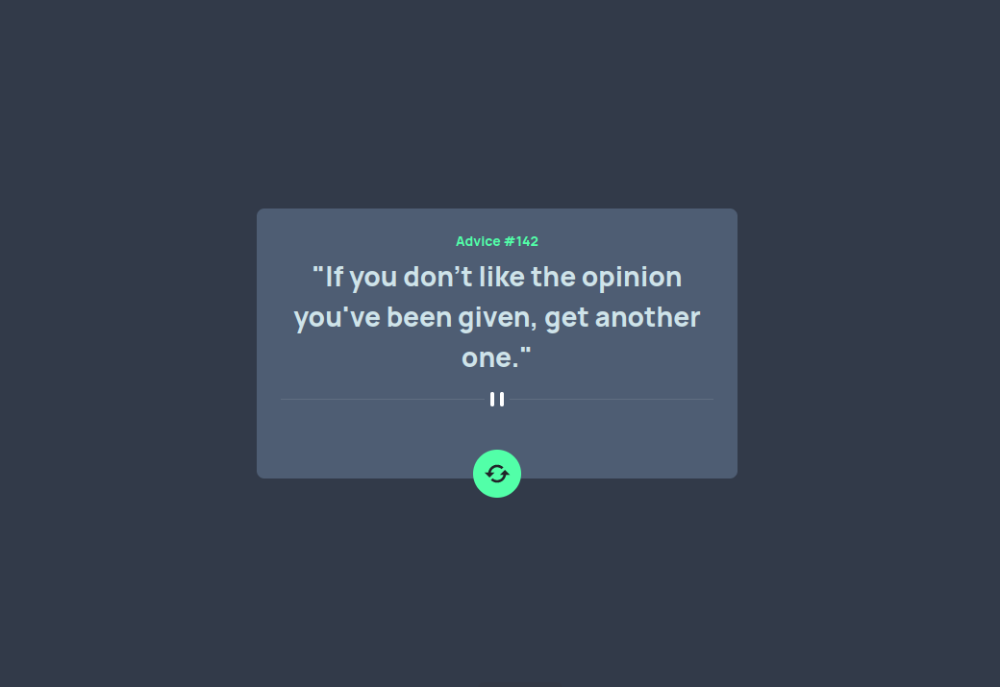

# Frontend Mentor - Gerador de Conselhos(Advice)

Solução para o desafio proposto em: [Advice generator app challenge on Frontend Mentor](https://www.frontendmentor.io/challenges/advice-generator-app-QdUG-13db).
## Sumário

- [Resumo](#overview)
  - [O Desafio](#the-challenge)
  - [Preview](#screenshot)
  - [Links](#links)
- [Desenvolvimento](#my-process)
  - [Tecnologias Utilizadas](#built-with)
  - [O que aprendi](#what-i-learned)
  - [O que pretendo melhorar](#continued-development)
- [Autor](#author)

## Resumo

### O Desafio

Requisitos do projeto:

- Responsividade de tela
- Elementos hovers para interatividade
- Gerar novos conselhos através do botão

### Screenshot




### Links

- Projeto Online: [Add live site URL here](https://advice-two.vercel.app/)

## Desenvolvimento

### Tecnologias Utilizadas

- React
- CSS Modules
- React-Bootstrap
- Fetch

### O que aprendi

Nesse projeto, obtive um conhecimento sobre o cache de navegadores. Pois, a API utilizada (adviceslip), tem por configuração padrão, mandar a mesma requisição caso solicitado em 2s. Como o projeto tem um botão de Refresh, para que o usuário possa solicitar um novo Advice, isso se tornou um problema. Pois, sempre que solicitado um novo Advice, era mandado o mesmo, devido ao tempo de solicitação. 

Como solução, pensei em utilizar o setTimeInterval, mas sem sempre funcionava, pois por padrão a requisição era mandada com o cache do navegador para ajudar na velocidade.

Então, aprendi como fazer solicitações sem utilização de cache utilizando o seguinte trecho de código:

```js
const http = await fetch('https://api.adviceslip.com/advice', {cache: 'no-store'})
```


### O que pretendo melhorar

Pretendo refazer o mesmo projeto, em diferentes branchs, utilizando tailwind css / bootstrap para estudo das tecnologias.

## Autor

- Frontend Mentor - [@mateusmenesesDev](https://www.frontendmentor.io/profile/mateusmenesesDev)
- Linkedin - [@mateus-meneses](https://www.linkedin.com/in/mateus-meneses/)

